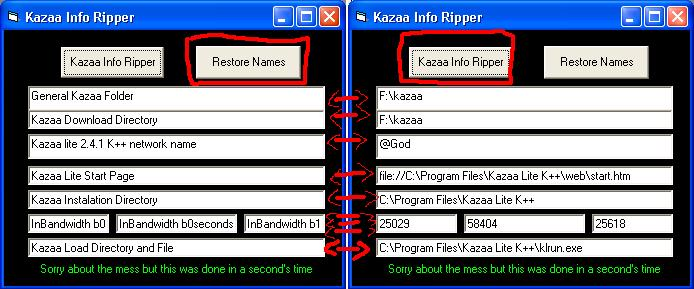

## Kazaa info finder

### Description

Kazaa Info Ripper opens your registry, and find out every info about your kazaa and kazaa lite aplications eg: Kazaa download folder, kazaa directory, KAzaa lite Startpage and network name (like @kazaalite.tk) , Kazaa directory, kazaa anotated download bandwidth and more! This is all VERY VERY SIMPLE and even a CHIPANSE could follow! Insert this into your project at will.. very easy to integrade!  I use Kenneth Ives's bas registry module to access the module easily
 
### More Info
 
evey kazaa aspect that is worth seeing!

             |
---                |---
**Submitted On**   |2003-08-06 01:00:10
**By**             |[Master Spy](https://github.com/Planet-Source-Code/PSCIndex/blob/master/ByAuthor/master-spy.md)
**Level**          |Intermediate
**User Rating**    |4.3 (13 globes from 3 users)
**Compatibility**  |VB 6\.0
**Category**       |[Registry](https://github.com/Planet-Source-Code/PSCIndex/blob/master/ByCategory/registry__1-36.md)
**World**          |[Visual Basic](https://github.com/Planet-Source-Code/PSCIndex/blob/master/ByWorld/visual-basic.md)
**Archive File**   |[Kazaa\_info162466862003\.zip](https://github.com/Planet-Source-Code/master-spy-kazaa-info-finder__1-47438/archive/master.zip)

